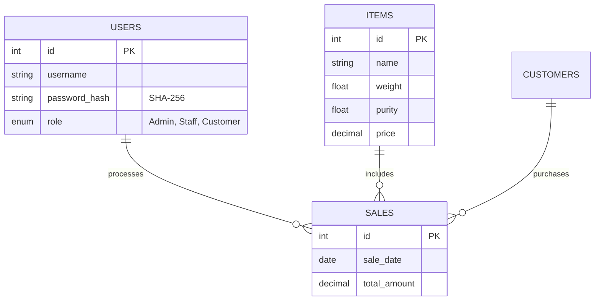

  # 🌟 Gold Inventory Management System
  **Smart, Secure & Modern Java Swing Application for Jewelry Businesses**

  <p>
    
    
    
    
    
  </p>


## 📖 Overview

The **Gold Inventory Management System** is a premium desktop solution designed to modernize jewelry store operations. Built with a robust **Java Swing** frontend and **MySQL** backend, it automates the tedious tasks of inventory tracking, sales management, and financial reporting.

> **Core Mission:** To replace manual ledgers with a secure, digital, and automated ecosystem using SHA-256 security and Apache POI automation.

---

## 💎 Key Features

| 🔐 Secure Authentication | 📊 Business Logic | 🎨 Modern Experience |
| :--- | :--- | :--- |
| **SHA-256 Hashing** for passwords | **Live Inventory** tracking | **Navy + Gold** Premium Theme |
| Role-based Access (**Admin/Staff**) | **Auto-Price Calculation** | **Animation Effects** (Bubbles) |
| SQL Injection Protection | **Purchase History** Logs | Clean, Responsive Tables |
| Session Validation | **Excel Reporting** (Apache POI) | Interactive Dashboards |

---

## 🖼 UI Showcase

<details>
<summary><b>📸 Click here to view App Screenshots</b></summary>
<br>

> **Note:** These images serve as a preview of the actual application interface.

| **Welcome Screen** | **Create Account** |
| :---: | :---: |
|  |  |

<div align="center">
  <b>🔹 Customer Dashboard 🔹</b><br>
  
</div>

</details>

---

## 🧱 Architecture

### 📂 File Structure
```bash
gold-inventory-system/
│
├── com.goldinventory
│   ├── GoldInventoryManagementSystem.java   # 🚀 Entry point
│   ├── database/DBConnection.java           # 🔌 MySQL Singleton
│   ├── service/AuthService.java             # 🔐 SHA-256 Logic
│   ├── service/ExcelExporter.java           # 📊 Apache POI Report
│   └── ui/
│       ├── LoginFrame.java
│       ├── admin/AdminDashboardFrame.java
│       └── customer/CustomerDashboardFrame.java
│
└── pom.xml                                  # Maven Dependencies
````

### 🧬 Database Schema (ER Diagram)




-----

## ⚙️ Technologies Used

| Category | Tech Stack |
| :--- | :--- |
| **Language** | Java 11+ (JDK) |
| **Database** | MySQL 8.0 |
| **GUI Framework** | Java Swing (javax.swing) |
| **Build Tool** | Apache Maven |
| **Reporting** | Apache POI (Excel Export) |
| **Security** | SHA-256 MessageDigest |

-----

## 🚀 Setup Guide

### 1️⃣ Prerequisites

  * MySQL Server Installed
  * Java JDK 11+
  * Maven

### 2️⃣ Database Setup

Execute this SQL command to initialize the system:

```sql
CREATE DATABASE gold_inventory_db;
USE gold_inventory_db;
-- Import the provided schema.sql file here
```

### 3️⃣ Installation

```bash
# Clone the repository
git clone [https://github.com/navin-oss/gold-inventory-management.git](https://github.com/navin-oss/gold-inventory-management.git)

# Navigate to project
cd gold-inventory-management

# Update Database Credentials
# Go to: src/com/goldinventory/database/DBConnection.java

# Run Application
java -jar target/gold-inventory-system.jar
```

-----

## 🔑 Default Credentials

| Role | Username | Password | Access Level |
| :--- | :--- | :--- | :--- |
| **Admin** | `admin` | `admin` | 🔴 Full Access (Edit/Delete) |
| **Staff** | `staff1` | `staff123` | 🟡 Sales & Inventory View |
| **Customer** | `customer1` | `customer123` | 🟢 Purchase History Only |

-----

## 👥 Team GOLD

> A dedicated team building secure and modern inventory software.

| 🌟 **Navin** | 🎨 **Sarthak** | 🧪 **Prasenjeet** |
|-------------|---------------|------------------|
| Backend Engineering<br>Auth Service (SHA-256)<br><i>Database Architecture</i> | Java Swing UI<br>Dashboard Design<br><i>UX Flow Optimization</i> | Testing Suite<br>Documentation<br><i>Excel Export (Apache POI)</i> |


## 🏷 Tags

`java` `swing` `mysql` `inventory-management` `desktop-app` `apache-poi` `excel-export` `jdbc` `oop` `java-gui`

<div align="center">
  <sub><b>✨ Team GOLD — Crafting Smart Inventory Systems ✨</b><br>
  © 2025 All Rights Reserved.</sub>
</div>
